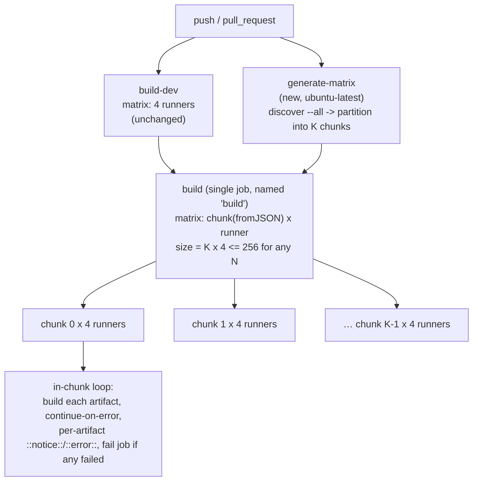
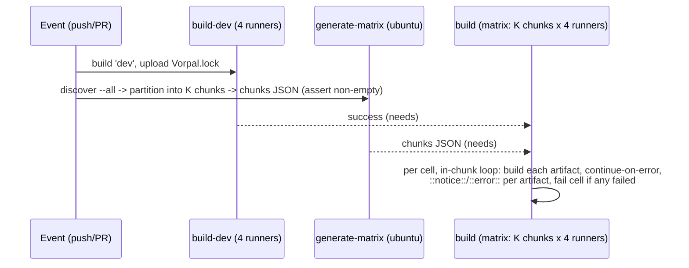

# GitHub Actions Matrix Parallelism for the `build` Job

## Problem Statement

**What.** `.github/workflows/ci.yaml` defines a `build` job whose `strategy.matrix`
is the Cartesian product of `artifact` (66 hardcoded entries) and `runner` (4
entries) = **264 matrix configurations**. GitHub Actions caps a single matrix at
256 jobs per workflow run, so the workflow fails at matrix-expansion time (config
validation) before any build executes.

**Why now.** The ceiling is already breached (264 > 256). Every new artifact added
to `src/artifact/` widens the gap. The build job cannot run at all until the matrix
is restructured.

**Who is affected.** Every PR and every push to `main` — CI cannot validate any
artifact build while the matrix is over the limit. Contributors adding artifacts are
blocked.

**Constraints.**
- DESIGN ONLY — this TDD changes no source; it specifies the strategy `@senior-engineer`
  will implement.
- Out of scope (per task brief): any "changed/affected artifacts" selective-subset
  approach that builds only some artifacts per run; changes to `build-dev`, secret
  handling, or `setup-vorpal-action` wiring; reintroducing the removed `zlib` source
  artifact.
- Must preserve the existing `build` → `needs: build-dev` dependency.
- A job named `build` MUST remain as the branch-protection required status check
  (operator decision, OQ2 resolved).

**Acceptance criteria.**

| # | Criterion | How the design satisfies it |
|---|---|---|
| AC1 | Every artifact is built on every one of the 4 runners on every run — full coverage, no skips. | The full discovered artifact set is partitioned into chunks with every artifact in exactly one chunk (§4.1, verified); the chunk×runner matrix runs every chunk on every runner (§4.2). |
| AC2 | No single matrix produces > 256 configurations, AND the design stays under the limit as artifacts are added (unbounded, not a one-time trim). | Matrix size = `chunk_count × 4`, where `chunk_count` is capped (§4.3); since the cap holds `chunk_count × 4 ≤ 256` for ANY artifact count, the matrix never exceeds the limit no matter how many artifacts are added. |
| AC3 | Uses GitHub Actions parallelism (sharding / chunking / dynamic matrix via `fromJSON`), not serialized builds. | A discovery job dynamically generates the chunk list (`fromJSON`); chunks run in parallel across all runners (§4.2). Builds are serialized only *within* a chunk (the accepted granularity tradeoff of chunking). |
| AC4 | Deliverable is a design/plan document only; nothing is implemented. | This TDD. No workflow or source files are modified. |

**Business context.** `artifacts.vorpal` is a build-recipe catalog whose only
operational signal is the GitHub Actions run (per `docs/spec/operations.md` §8.2). A
non-running `build` job means zero cross-platform build validation — the project's
core quality gate is dark until this is fixed. The chunking design deliberately
preserves a per-artifact pass/fail signal (§4.2, §10) even though artifacts no longer
map 1:1 to matrix cells.

## Context & Prior Art

**In-repo precedent.**
- `.github/workflows/ci.yaml` — two jobs today: `build-dev` (matrix of 4 runners,
  builds `dev`, uploads `Vorpal.lock`) and `build` (the failing 264-config matrix).
  `build` `needs: build-dev`. A `concurrency` group cancels in-progress runs on new
  pushes.
- `script/detect-changed-artifacts.sh` — an existing, **tested** (`script/test-detect-changed-artifacts.sh`)
  artifact-discovery tool. It scans `src/artifact/*.rs`, excludes `file.rs`, converts
  filename underscores to hyphens, and emits the artifact list. `--all` prints a
  compact JSON array; `--list` prints one name per line. OBSERVED after removing the
  unused `zlib` source artifact: `--list` emits exactly the 64 source-discovered
  artifacts, and `zlib` is absent.
- `src/vorpal.rs` — invokes artifact builds under hyphenated names. OBSERVED via
  `grep 'let name = "..."'` in `src/artifact/*.rs`: all 64 discovered artifact names
  are hyphenated; the `file.rs` utility and removed `zlib` source are not part of the
  discovered artifact set.

**Removed-source reconciliation (DKT-6 / DKT-4).** `zlib` is intentionally excluded
from the source-discovered set rather than registered in `src/vorpal.rs`. DKT-4 is a
verification-only task: it must prove `zlib` is absent from
`bash script/detect-changed-artifacts.sh --list`, from
`bash script/detect-changed-artifacts.sh --all`, and from the generated chunk JSON.
It must not add a removed-artifact buildability step.

**Naming-correctness finding (preserved benefit).** The current `ci.yaml` matrix
hand-lists 5 artifacts with **underscores** — `json_c`, `golangci_lint`,
`libgpg_error`, `openapi_generator_cli`, `pkg_config` — plus a spurious `file` entry
that is not a registered artifact. The registered names are hyphenated
(`json-c`, …). Because the `build` job has never executed (the matrix fails the 256
check before any job starts), it has never been OBSERVED whether `vorpal build 'json_c'`
resolves; INFERRED, those entries would fail at build time. Generating the matrix from
the discovery script (which emits the correct hyphenated set) fixes this latent bug as
a side effect of removing the hand-maintained list.

**External precedent.**
- GitHub's documented limit: *"A matrix will generate a maximum of 256 jobs per
  workflow run."* OBSERVED wording from GitHub docs (see Sources). The limit is
  **per matrix**. The chunking design keeps the single build matrix bounded by
  construction rather than relying on splitting work across several matrices.
- Dynamic matrix via `fromJSON`: a generator job sets a JSON string output; a
  downstream job uses `strategy.matrix.<dim>: ${{ fromJSON(needs.<gen>.outputs.<key>) }}`.
  OBSERVED in GitHub's "Using a matrix for your jobs" docs. Matrix dimension values may
  be arbitrary JSON (including arrays), consumed in steps via `toJSON(matrix.<dim>)`.
- `max-parallel` throttles concurrent jobs within one matrix; absent it, GitHub runs as
  many as runner availability and the account's concurrency limit allow.



## Alternatives Considered

### Alternative A — Per-runner jobs with a hardcoded artifact list (no discovery)

**Shape.** Split `build` into 4 jobs, one per runner. Each job's matrix is `artifact`
only (the hand-maintained list), with a fixed `runs-on`. 4 matrices × ≤ 256 each.

**Strengths.** Minimal moving parts; full per-artifact granularity in the Actions UI.

**Weaknesses.** The artifact list stays hand-maintained — and is *already wrong*
(5 underscore names + spurious `file`). Duplicates the `setup-vorpal-action` block 4×.
**Finite ceiling**: breaks again at 256 artifacts per runner — a one-time trim, not
unbounded scaling.

**Verdict.** Rejected. Perpetuates manual-list maintenance and the naming bug, and
does not meet the unbounded-scaling requirement.

### Alternative C — Dynamic discovery + per-runner matrix split (no chunking)

**Shape.** A `generate-matrix` job outputs the artifact JSON; the build work is split
per-runner (4 jobs, or a reusable workflow called once per runner via a 4-entry runner
matrix), each per-runner matrix consuming the artifact list via `fromJSON`. Each
  matrix expands to `N_artifacts` (64 today) ≤ 256.

**Strengths.** Removes the hand-maintained list and fixes the naming bug. **Full
per-artifact granularity** in the Actions UI (one cell = one artifact × one runner) —
the cleanest possible failure isolation and the strongest realization of
`operations.md` §8.2's per-artifact signal. Full per-artifact parallelism.

**Weaknesses (why rejected now).**
- **Finite ~4× ceiling.** Each per-runner matrix is `N_artifacts`; it breaks once a
  single runner's artifact count exceeds 256 (~192 of growth from today). That is a
  larger ceiling than A, but still a ceiling — it does not satisfy "stays under the
  limit as artifacts are *continually* added."
- **Dependence on officially-undocumented behavior.** The DRY reusable-workflow variant
  relies on each reusable-workflow invocation receiving its own 256-job matrix budget
  (community discussion #38704). GitHub does not document this as a guarantee, so the
  design's correctness would hinge on observed-but-unspecified platform behavior that
  could change. (The 4-explicit-jobs variant avoids this but reintroduces the 4× setup
  duplication.)

**Verdict.** Rejected in favor of B. C is retained here because it is the better answer
*if* per-artifact UI granularity is the top priority and the catalog will never approach
256 per runner — but the operator has prioritized unbounded, documented-limit-compliant
scaling and explicitly accepted the loss of per-artifact granularity that B entails.

### Alternative B — Dynamic discovery + chunking into a bounded chunk×runner matrix (ACCEPTED)

**Shape.** A `generate-matrix` job runs `script/detect-changed-artifacts.sh --all`,
partitions the discovered list into `K` chunks (`K` capped so `K × 4 ≤ 256`), and
outputs the chunks as JSON. A single `build` job uses a `chunk × runner` matrix; each
cell builds its chunk's artifacts in an in-chunk loop with per-artifact failure
aggregation.

**Strengths.** **Unbounded scaling** — matrix size is `K × 4` with `K` capped, so it is
**constant and ≤ 256 for any artifact count** (the chunk *size* grows with N, not the
matrix). Removes the hand-maintained list and fixes the naming bug (shared with C).
**Structurally simplest**: one `build` job, one matrix, no reusable workflow and no
per-runner duplication — which also **dissolves C's sibling-matrix and
undocumented-budget risks entirely** (there is only one matrix, kept bounded by
construction). Sharply fewer total jobs (32 vs 264 today), reducing scheduler/runner
pressure, `setup-vorpal-action` overhead, and S3-registry write concurrency.

**Weaknesses.** Loses 1:1 per-artifact matrix cells — a chunk is the matrix unit.
Artifacts within a chunk build serially, so per-job duration grows with chunk size
(a concern for heavy source builds like `ffmpeg`, `gpg`, `openjdk`). Mitigated by
(a) per-artifact `::notice::`/`::error::` annotations + end-of-job aggregation so the
per-artifact signal is preserved (§4.2), and (b) a tunable chunk-size knob (§4.3).

**Verdict.** **Accepted** (operator decision). Satisfies AC1–AC4, is the only option
that scales without an eventual limit re-breach, and is structurally the simplest.

## Architecture & System Design

The accepted approach (Alternative B) introduces one new `generate-matrix` job and
replaces the `build` job's `artifact × runner` matrix with a bounded `chunk × runner`
matrix. The job named `build` is retained (branch-protection required check, OQ2).

### 4.1 Artifact enumeration (the single source of truth)

- The chunk list is generated from `script/detect-changed-artifacts.sh --all`, which
  emits a JSON array of hyphenated artifact names. OBSERVED: `--all` exists and emits
  compact JSON. This makes `src/artifact/*.rs` (minus `file.rs` and the removed
  `zlib` source) the single source of truth; adding `src/artifact/foo.rs` automatically
  adds `foo` to the next run.
- The `--all` mode (full list) is used deliberately — NOT the script's commit-range
  change-detection mode. Selective/changed-only builds are out of scope; every run
  builds the full set (AC1).
- DKT-4 verifies the accepted `zlib` resolution by proving exclusion from the source
  discovery outputs and generated chunks. The design must not turn removal into a
  build gate or registration follow-up.
- AUTHORITY note: the discovery script is the authority for the artifact set. The
  implementation must not reintroduce a second hand-maintained copy of the list in YAML.

### 4.2 The `build` job: bounded chunk×runner matrix with in-chunk aggregation

1. **`generate-matrix`** (job, `runs-on: ubuntu-latest`, no `needs` — runs in parallel
   with `build-dev`): checkout, discover the artifact list, partition into `K` chunks,
   set step output `chunks=<json-array-of-arrays>`, expose as job output `chunks`. The
   step asserts the output is non-empty (`jq -e 'length>0'`) and fails otherwise (R2).
2. **`build`** (job, name preserved): `needs: [build-dev, generate-matrix]`,
   `runs-on: ${{ matrix.runner }}`, with
   `strategy: { fail-fast: false, matrix: { chunk: ${{ fromJSON(needs.generate-matrix.outputs.chunks) }}, runner: [macos-latest, macos-latest-large, ubuntu-latest, ubuntu-latest-arm64] } }`.
   Steps: checkout, `setup-vorpal-action` (unchanged S3/secrets env), then the in-chunk
   build loop below. `fail-fast: false` keeps one chunk's (or runner's) failure from
   cancelling the others.
3. **In-chunk loop** (the mechanism that preserves the per-artifact signal — VERIFIED
   behavior, see §9):

   ```bash
   failed=()
   while IFS= read -r a; do
     if vorpal build "$a"; then
       echo "::notice::$a OK"
     else
       echo "::error::$a FAILED"
       failed+=("$a")
     fi
   done < <(echo '${{ toJSON(matrix.chunk) }}' | jq -r '.[]')
   if [ ${#failed[@]} -gt 0 ]; then
     echo "Failed artifacts in chunk: ${failed[*]}"
     exit 1
   fi
   ```

   Every artifact in the chunk is attempted regardless of earlier failures (no early
   exit); each emits a per-artifact `::notice::`/`::error::` annotation (GitHub surfaces
   these per-line, recovering most of the per-artifact visibility lost to chunking); the
   job fails at the end iff any artifact failed.

**Single matrix, no reusable workflow.** Because chunking collapses the artifact
dimension into the chunk dimension, the whole build fits in ONE matrix on ONE job named
`build` — no per-runner split, no reusable workflow, no `setup-vorpal-action`
duplication. This is why B dissolves C's reusable-workflow caveats. *If* a reusable
workflow were ever introduced for the chunk job, two things become mandatory (C2/C3):
`fail-fast: false` on the caller matrix too, and `secrets: inherit` on the call (secrets
do NOT auto-propagate to a called workflow — the callee would otherwise receive empty
AWS credentials). The recommended inline form avoids both.



### 4.3 Chunk-count cap (the AC2 invariant), chunk-size knob, fail-fast, concurrency

- **The bounding invariant (AC2).** Let `R` = runner count (4 today, fixed per scope)
  and `K` = chunk count. The single matrix has `K × R` cells. The generator enforces
  `K ≤ MAX_CHUNKS` where `MAX_CHUNKS × R ≤ 256`. With `R = 4`, `MAX_CHUNKS ≤ 64`;
  **recommended `MAX_CHUNKS = 50`** → matrix ≤ 200, comfortable headroom below 256 (and
  avoids sitting exactly at the limit). Because `K` is capped, `K × R ≤ 256` for **any**
  artifact count `N` — this is what makes the design unbounded rather than a one-time
  trim.
- **Chunk-size knob.** `K = min(MAX_CHUNKS, max(1, ceil(N / TARGET_CHUNK_SIZE)))`.
  `TARGET_CHUNK_SIZE` is the tunable that trades parallelism/granularity against per-job
  duration (more, smaller chunks = more parallel jobs + finer signal + more setup
  overhead; fewer, larger chunks = longer serial jobs + fewer setup runs). For `N = 64`
  with `TARGET_CHUNK_SIZE = 8`: `K = 8` → **32-job matrix** (VERIFIED via jq, §9);
  the current static cap evidence is `K × 4 = 32 ≤ 256`.
  Setting `TARGET_CHUNK_SIZE ≈ 13` yields `K = 5` → the ~20-job figure the operator
  referenced. As `N` grows, `K` rises until it pins at `MAX_CHUNKS`, after which chunk
  size grows and the matrix stays constant at `MAX_CHUNKS × 4`.
  - **Tradeoff caveat (honest critique).** Several artifacts are heavy source builds
    (`ffmpeg`, `gpg`, `openjdk`, `nginx`). With large chunks these serialize into long
    jobs; if one heavy build dominates a chunk, that cell's wall-clock suffers. Partition
    round-robin (stripe by sorted index) rather than contiguous so heavy artifacts spread
    across chunks. Recommend tuning `TARGET_CHUNK_SIZE` after observing first-run
    durations; start smaller (more parallelism) and increase only if setup overhead or
    runner-minute cost dominates.
- **Partition method.** Round-robin striping (artifact index `mod K`) over the sorted
  discovered list. VERIFIED (§9): every artifact lands in exactly one chunk; chunk sizes
  differ by at most 1 — balanced coverage with no duplication or omission (AC1).
- **fail-fast.** `fail-fast: false` on the `chunk × runner` matrix so one chunk/runner
  failure does not cancel the rest. Combined with the in-chunk continue-on-error loop,
  a single artifact failure neither cancels its chunk-mates nor other cells.
- **max-parallel / concurrency.** Do NOT set `max-parallel` initially. Under B the total
  job count drops sharply (32 vs 264 today), which **largely de-risks** the original
  S3-registry write-contention / runner-exhaustion concern (R3) — there is no longer a
  0→264 concurrent-job spike. The existing top-level `concurrency` group
  (`cancel-in-progress: true`) is unchanged. Revisit `max-parallel` only if contention is
  later measured.

### 4.4 build-dev dependency preservation

`build-dev` is unchanged (its own 4-runner matrix). The `build` job declares
`needs: [build-dev, generate-matrix]`, so artifact builds still wait for the dev
environment. `generate-matrix` has no `needs` and runs concurrently with `build-dev`,
adding no wall-clock latency to the critical path.

## Data Models & Storage

N/A. This design changes CI orchestration only; it introduces no schema, persistence,
or migration of stored data. The S3 registry and `Vorpal.lock` artifact flow are
untouched.

## API Contracts

The contract introduced is the **chunk-generation interface** between
`generate-matrix` and the `build` job:

- **Producer:** `generate-matrix` job. Steps: run `script/detect-changed-artifacts.sh --all`
  to get the name array `A`; compute `K = min(MAX_CHUNKS, max(1, ceil(length(A) / TARGET_CHUNK_SIZE)))`;
  partition `A` round-robin into `K` sub-arrays; set job output `chunks` to the JSON
  array-of-arrays. Reference jq (VERIFIED, §9):
  `jq -c --argjson k "$K" '[ to_entries | group_by(.key % $k)[] | map(.value) ]'`.
  The step MUST assert `jq -e 'length>0'` on the result and fail otherwise (R2).
- **Consumer:** `build` job. `strategy.matrix.chunk: ${{ fromJSON(needs.generate-matrix.outputs.chunks) }}`
  (a matrix dimension whose values are arrays). In-step access via
  `echo '${{ toJSON(matrix.chunk) }}' | jq -r '.[]'`.
- **Invariants:** (a) `chunks` is a non-empty JSON array of non-empty string arrays;
  (b) the union of all chunks equals the discovered set with no duplicates (AC1);
  (c) `length(chunks) × 4 ≤ 256` (AC2).
- `vorpal build` CLI invocation shape is unchanged: `vorpal build '<artifact>'`.

## Migration & Rollout

**Current state.** Single `build` job, 264-config `artifact × runner` matrix, fails at
expansion; build job never runs.

**Target state.** `build-dev` (unchanged) + `generate-matrix` (new) + `build`
(chunk×runner matrix, 32 cells today and capped at ≤ 200 cells, in-chunk aggregation
loop). Job name `build` preserved.

**Rollout sequencing.** CI configuration with no runtime/data state; rollout is a single
PR validated by the PR's own CI run (the workflow tests itself). Sequence within the PR
per §11: add generator → restructure build → verify expansion, coverage, and `zlib`
exclusion.

**Backward compatibility.** No consumers depend on internal job structure. `build-dev`'s
`Vorpal.lock` upload and job name are preserved. The branch-protection required check
(`build`) keeps its name (OQ2), so protection rules need no change.

**Rollback plan.** Revert the single PR; `git revert` restores the prior `ci.yaml`.
Because the change is confined to `.github/workflows/ci.yaml`, rollback is immediate and
lossless. The prior state is itself broken (over the limit), so rollback is only a
fallback if the new structure mis-partitions — in which case the `generate-matrix`
output and the `fromJSON` wiring are the first diagnostics.

## Risks & Open Questions

| ID | Risk | Likelihood | Impact | Mitigation |
|----|------|-----------|--------|------------|
| R1 | Chunk-count cap misconfigured (`K × 4 > 256`) re-breaches the limit | Low | High (CI dark) | The generator computes `K` from the capped formula (§4.3); a static AC asserts `K × 4 ≤ 256` (§9 / §11 Phase 1). Note: B's bounded-by-construction matrix DISSOLVES C's sibling-matrix (C4) and undocumented reusable-workflow-budget (C5) risks — there is only one matrix. |
| R2 | Generator emits empty/garbled JSON → matrix runs 0 jobs (an empty matrix is not an error in GHA) → false-green | Low | High | Generator asserts non-empty (`jq -e 'length>0'`) and fails the job otherwise; AC in §11 Phase 1. |
| R3 | Parallel `vorpal build` contends on the S3 registry / exhausts concurrency | Low (de-risked) | Medium | B cuts total jobs by about 8× today (32 vs 264), removing the 0→264 spike; no `max-parallel` initially; add as a throttle only if contention is measured. |
| R4 | Branch-protection required-check name drift when `build` is restructured | Low (resolved) | Medium | The job stays named `build` (operator decision, OQ2); §11 Phase 3 confirms the required check still resolves. |
| R5 | A heavy source build (`ffmpeg`/`gpg`/`openjdk`) makes its chunk's job long | Medium | Low/Medium | Round-robin partition spreads heavy artifacts; `TARGET_CHUNK_SIZE` is tunable (§4.3); `fail-fast: false` isolates duration impact to the affected cell. |

**Open questions.**
- OQ1 (architecture): RESOLVED — operator selected Alternative B (chunking).
- OQ2 (branch protection): RESOLVED — keep a job named `build` as the required check.
- OQ3 (tuning): `TARGET_CHUNK_SIZE` default. Recommendation: start at 8 (`K=8`, 32-job
  matrix) and tune after observing first-run durations. *Resolved-by:* implementation
  empirics; not a blocker for vote.

## Testing Strategy

CI workflows are validated primarily by executing them; the implementing PR exercises
the full path on real runners. The mechanics below were exercised during authoring.

**Test levels.**
- **Chunk-partition correctness (VERIFIED during authoring).** With the 64-name list,
  `TARGET_CHUNK_SIZE=8`, `MAX_CHUNKS=50`: jq partition produced `K=8` chunks, sizes
  `[8,8,8,8,8,8,8,8]` (=64), every artifact present exactly once (`add|sort|length` == N),
  and `K × 4 = 32 ≤ 256`. The implementation must reproduce these invariants as a
  generator self-check.
- **In-chunk aggregation (VERIFIED during authoring).** A simulated loop with a forced
  mid-chunk failure attempted all artifacts (no early exit), emitted per-artifact
  `::notice::`/`::error::`, and exited 1 only at the end. The implementation must
  reproduce this continue-on-error + aggregate-fail behavior.
- **Static / pre-merge inspection (AC2 evidence).** `K=$(detect-changed-artifacts.sh --all | jq 'length' | ...)`;
  assert `K × 4 ≤ 256`. Today: `N=64 → K=8 → 32 ≤ 256`.
- **Removed-artifact exclusion (DKT-4 evidence).** Assert `zlib` is absent from
  `detect-changed-artifacts.sh --list`, from `detect-changed-artifacts.sh --all`, and
  from generated chunk JSON.
- **Workflow self-test (integration).** The implementing PR's CI run must expand without
  the 256 error (AC2) and show `K × 4` build cells running in parallel (AC1, AC3).
- **Discovery script regression.** Re-run `script/test-detect-changed-artifacts.sh`
  (unchanged) to confirm the `--all` JSON contract the generator depends on still holds.
- **Naming-correctness check.** Diff `detect-changed-artifacts.sh --list` against
  registered names (`grep -rhoE 'let name = "[a-z0-9-]+"' src/artifact/`) — expect an
  exact match (guards the underscore/`file` fix from regressing).
- **Coverage reconstruction.** Assert the union of all `chunks` equals the discovered
  set (no artifact dropped or duplicated by partitioning) — AC1.

**Coverage of acceptance criteria.**
- AC1 → coverage-reconstruction check + workflow self-test (every artifact in some
  chunk, every chunk on every runner).
- AC2 → static `K × 4 ≤ 256` assertion + the PR run no longer erroring at expansion.
- AC3 → Actions UI shows parallel chunk cells; in-chunk serialization is the accepted
  tradeoff.
- AC4 → N/A at runtime; this is a design doc.

### Untested-claims inventory (forward-looking / currently-unreachable branches)

- **`MAX_CHUNKS` cap arm.** With `N=64` and `MAX_CHUNKS=50`, `K=ceil(64/8)=8` never
  reaches the cap, so the `min(MAX_CHUNKS, …)` clamp is dead-on-arrival today. Do NOT
  fabricate an end-to-end test against the clamped path. Instead, extract the
  `K`-computation into a small pure shell/jq function and unit-test it in isolation with
  a synthetic large `N` (e.g. `N=1000 → K=50`) to prove the clamp; record the live
  end-to-end exercise as a deferred gap (only reachable once the catalog exceeds
  `MAX_CHUNKS × TARGET_CHUNK_SIZE` ≈ 400 artifacts).
- **`max-parallel` throttle (R3).** Not set in Phase 1; only added if contention is
  measured. No test until/unless adopted.
- **Reusable-workflow `secrets: inherit` arm (C2/C3).** Not used by the recommended
  inline design; only relevant if a reusable workflow is later introduced. No test now.

## Observability & Operational Readiness

- **Signals.** Per-chunk job status in the matrix view, AND per-artifact
  `::notice::`/`::error::` annotations inside each chunk job — together these preserve
  the per-artifact pass/fail signal that `docs/spec/operations.md` §8.2 relies on,
  despite the loss of 1:1 matrix cells. The `generate-matrix` log shows the exact chunk
  partition used for the run (what was built and how it was grouped).
- **3am diagnosability.** Triage path: (1) did `generate-matrix` produce a sane
  non-empty chunk array? (its step output); (2) did `build-dev` succeed? (the `needs`
  gate); (3) which chunk cell failed, and which artifact(s) within it? (matrix view →
  the `::error::` annotations / "Failed artifacts in chunk" line). Each question maps to
  one place.
- **Production readiness.** No deploy/runtime surface; "production" is the CI pipeline.
  The change is self-validating on merge (the PR run proves it).
- **Runbooks.**
  - *Matrix over limit again:* check `K × 4`; if `K` is at `MAX_CHUNKS`, lower
    `MAX_CHUNKS` or confirm `R` (runner count) hasn't grown (R1).
  - *Zero jobs ran:* generator emitted empty/invalid chunks (R2) — inspect generator log.
  - *One artifact fails:* find it via the chunk job's `::error::` annotation; reproduce
    locally with `vorpal build '<artifact>'`.
  - *Required check missing after merge:* branch-protection name drift (R4) — the check
    should point at the `build` job.

## Implementation Phases

### Phase 1 — Add the `generate-matrix` job (discover + partition + guards)

- **Goal:** produce the bounded chunk array as a job output, with cap and non-empty guards.
- **File scope:** `.github/workflows/ci.yaml`.
- **Acceptance criteria:**
  - A `generate-matrix` job exists, `runs-on: ubuntu-latest`, no `needs`.
  - It discovers via `script/detect-changed-artifacts.sh --all`, computes
    `K = min(MAX_CHUNKS, max(1, ceil(N / TARGET_CHUNK_SIZE)))` with `MAX_CHUNKS = 50`,
    partitions round-robin, and sets job output `chunks`.
  - Non-empty guard present. AC command:
    `bash script/detect-changed-artifacts.sh --all | jq -e 'length > 0' >/dev/null`
    — expected exit 0 today; the step must encode this guard on the chunk output.
  - Cap guard present: the generator (or a CI check) asserts `K × 4 ≤ 256`.
  - Grep evidence: `grep -c 'generate-matrix' .github/workflows/ci.yaml` ≥ 1
    (expected ≥ 1).
- **Effort:** S.
- **Blocking deps:** none.
- **Out of scope:** any change-detection / commit-range mode — `--all` only.

### Phase 2 — Restructure `build` into a bounded chunk×runner matrix with in-chunk aggregation

- **Goal:** replace the 264-config `artifact × runner` matrix with a `chunk × runner`
  matrix (≤ 200 cells) on a job still named `build`.
- **File scope:** `.github/workflows/ci.yaml`.
- **Acceptance criteria:**
  - A job named exactly `build` exists with `runs-on: ${{ matrix.runner }}` and a matrix
    of `chunk` (from `fromJSON`) × `runner` (the 4 labels). AC command:
    `grep -nE '^\s+build:' .github/workflows/ci.yaml` — expected ≥ 1 hit.
  - `build` declares `needs:` including both `build-dev` and `generate-matrix`.
  - The chunk dimension is sourced via `fromJSON`. AC command:
    `grep -E 'fromJSON\(needs\.generate-matrix\.outputs\.chunks\)' .github/workflows/ci.yaml`
    — expected ≥ 1 hit.
  - `fail-fast: false` on the chunk×runner matrix. AC command:
    `grep -c 'fail-fast: false' .github/workflows/ci.yaml` — expected ≥ 1.
  - The in-chunk loop builds every artifact in the chunk with continue-on-error,
    per-artifact `::notice::`/`::error::`, and end-of-job aggregation (fail iff any
    failed).
  - The hardcoded 66-entry `artifact:` list is removed. AC command:
    `grep -cE '^\s+- (argocd|json_c|file)\b' .github/workflows/ci.yaml` — expected 0.
- **Effort:** M.
- **Blocking deps:** Phase 1.
- **Out of scope:** changes to `build-dev`, `setup-vorpal-action` inputs, secret/env
  wiring; introducing a reusable workflow (inline single-matrix is the chosen form).

### Phase 3 — Verify expansion, coverage, removed-artifact exclusion, and branch protection

- **Goal:** prove AC1–AC3 on a real run, confirm `zlib` exclusion, reconcile the required check.
- **File scope:** none (verification + repo settings).
- **Acceptance criteria:**
  - The PR's CI run expands without the 256 error and shows `K × 4` chunk cells running
    in parallel (AC1, AC2, AC3). Evidence: Actions run page.
  - Static count check: `K × 4 ≤ 256` where
    `K = $(bash script/detect-changed-artifacts.sh --all | jq 'length' | ...)`; today
    `N=64 → K=8 → 32`.
  - Removed-artifact exclusion:
    `bash script/detect-changed-artifacts.sh --list | grep -x zlib` emits no output
    and exits 1; `bash script/detect-changed-artifacts.sh --all | jq -e 'index("zlib") == null'`
    exits 0; flattening generated chunk JSON contains no `zlib`.
  - Coverage check: the union of `generate-matrix` `chunks` equals
    `detect-changed-artifacts.sh --list` (no artifact dropped/duplicated). AC command
    (conceptual): `jq -r 'add | sort | .[]' <chunks>` diffed against
    `detect-changed-artifacts.sh --list | sort` — expected empty diff.
  - Naming reconciliation:
    `diff <(bash script/detect-changed-artifacts.sh --list) <(grep -rhoE 'let name = "[a-z0-9-]+"' src/artifact/ | sed -E 's/let name = "(.*)"/\1/' | sort -u)`
    — expected empty (confirms the underscore/`file` fix holds).
  - Operator confirms the branch-protection required check points at the `build` job (R4).
- **Effort:** S.
- **Blocking deps:** Phase 2.
- **Out of scope:** changing the selected `zlib` removal resolution; DKT-5 is obsolete
  because the selected resolution is removal, not registration.
